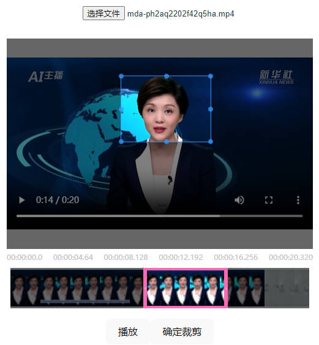
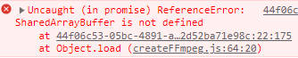
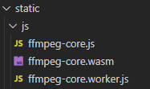

# Vue 3 + Vite + ffmpeg

视频裁剪demo，通过ffmpeg实现页面的视频裁剪功能

vue2(3)皆可使用，组件采用vue的选项式api写法，因此将组件复制到vue2版本的项目中一样可以使用。

## 运行
```
npm install
```
```
npm run dev
```

## 示例




## 跨源隔离

SharedArrayBuffer is not defined



原因：由于浏览器安全机制问题，SharedArrayBuffer函数被浏览器默认禁用，只有在开启了跨源隔离的浏览器下才能访问到window.SharedArrayBuffer函数。当window.crossOriginIsolated为true时，表示浏览器已开启跨源隔离。

开启跨源隔离：对index.html等静态资源添加两个响应头即可开启
``` js
"Cross-Origin-Opener-Policy": "same-origin"     // 开启跨源隔离
"Cross-Origin-Embedder-Policy": "require-corp"  // 仅加载同源资源和明确标记为可共享的资源
```

开发环境在配置文件`vite.config.js`中开启
``` js
server:{
    headers: {
        "Cross-Origin-Opener-Policy": "same-origin",
        "Cross-Origin-Embedder-Policy": "require-corp",
    }
}
```
生产环境在`nginx`等代理服务器开启
``` nginx
location / {
    root /demo;
    index index.html;
    try_files $uri $uri/ /index.html;
    add_header Cross-Origin-Opener-Policy 'same-origin';
    add_header Cross-Origin-Embedder-Policy 'require-corp';
}
```

第三方资源：由于开启了跨源隔离，所以非同源的第三方资源会被浏览器进行拦截，包括js、css、jpg、png等静态资源，因此在访问这些非同源的文件时，要确保这些文件明确标记允许跨源加载，也就是文件需要携带响应头
``` js
"Cross-Origin-Resource-Policy": "cross-origin"
```

## vue2 + webpack3.6

如果使用的是webpack3.x版本，在导入ffmpeg模块时会报错，需要手动指定``ffmpeg.min.js``和``ffmpeg.core,js``（需要找到node_modules中的``@ffmpeg/ffmpeg-core``模块，将dist文件夹下的文件复制到项目中的静态文件夹中，因为corePath需要使用http协议的链接进行访问）



``` js
import FFmpeg from '@ffmpeg/ffmpeg/dist/ffmpeg.min.js';
const { createFFmpeg, fetchFile } = FFmpeg;

const ffmpeg = createFFmpeg({
    log: false,
    corePath: 'static/js/ffmpeg-core.js'
});
```

    
## 文档

[ffmpeg](https://github.com/ffmpegwasm/ffmpeg.wasm/tree/master/)

[跨源隔离1](https://zhuanlan.zhihu.com/p/396062386)

[跨源隔离2](https://zhuanlan.zhihu.com/p/165776646)

[组件参考](https://blog.csdn.net/weixin_48888726/article/details/128718817)